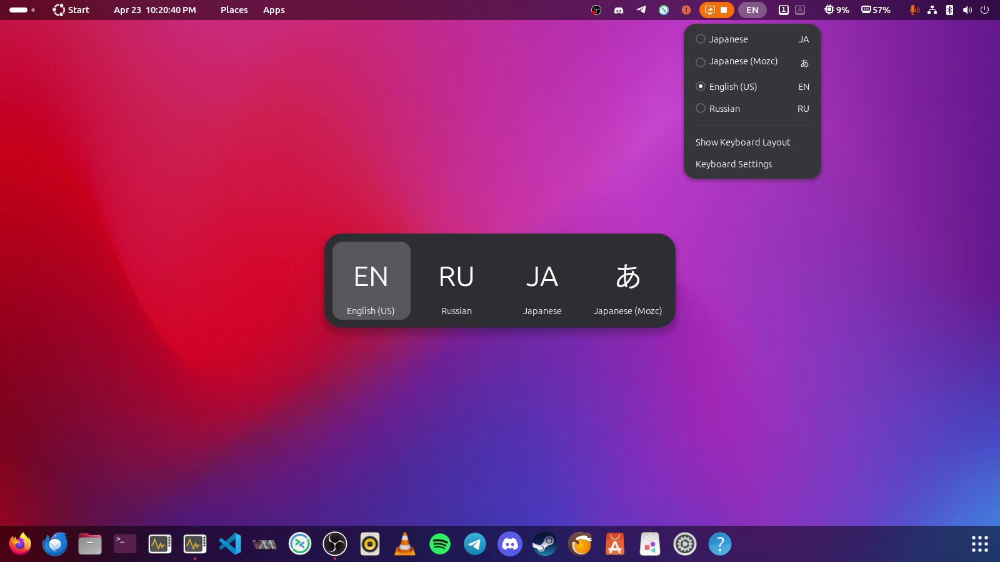

# Uppercase Input Source Indicator

A GNOME Shell extension that makes the current input source (language) indicator uppercase.

While this extension should work with IBus-powered input method editors, they have not been tested extensively.

Feel free to report any issues or to ask to add support for the latest GNOME Shell version.

[You can get this extension here (extensions.gnome.org).](https://extensions.gnome.org/extension/8672/uppercase-input-source-indicator/)

## System Requirements

This extension has been confirmed to work on the following GNOME Shell major versions:  
`46.x`, `47.x`, `48.x`, `49.x`, `50.x`.

## GNOME Educational Resources

[GNOME JavaScript](https://gjs.guide/)

[GNOME JavaScript - Developer Guides](https://gjs.guide/guides/)

[GNOME JavaScript - Shell Extensions](https://gjs.guide/extensions/)

## GNOME Repositories

[GNOME Shell on GitLab.com](https://gitlab.gnome.org/GNOME/gnome-shell)

[GNOME JavaScript on GitLab.com](https://gitlab.gnome.org/GNOME/gjs)
